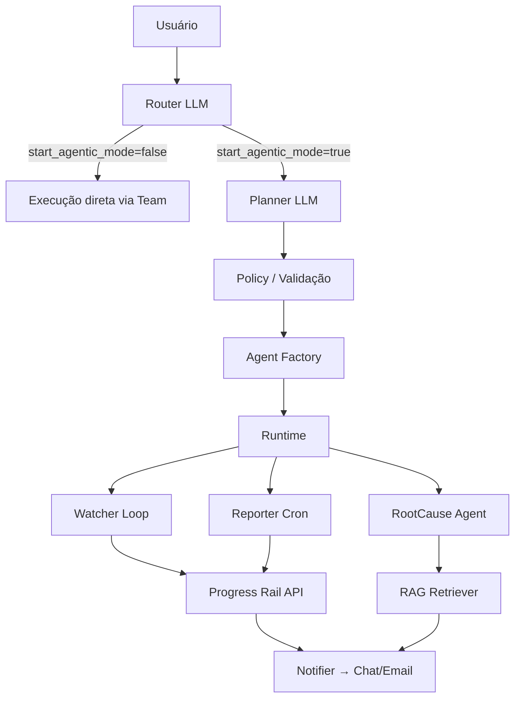

# 🚆 Sistema de Orquestração de Agentes Dinâmicos para Monitoramento Ferroviário

Este projeto implementa um **framework de agentes efêmeros com modo agêntico on-the-fly**, usando um **Router** para entender a intenção do usuário, um **Planner** para gerar especificações de agentes (AgentSpec), e um **Runtime** que cria e gerencia esses agentes dinamicamente.

---

## **📌 Objetivo do Sistema**
- Permitir que o usuário envie comandos em linguagem natural, como:
  - “Acompanhe o trem G76 e me avise quando houver paradas ou atrasos.”
  - “Crie um relatório diário da série SD70 às 6h com SOPs relevantes.”
  - “Me informe o status do G76 agora.”
- Decidir **quando criar agentes efêmeros** (para tarefas contínuas ou agendadas) e quando executar ações **pontuais** (status, insights).
- Integrar com:
  - **API Progress Rail** (telemetria, status, ETA)
  - **RAG** (vector DB para SOPs e insights)
  - **Notificadores** (chat/email/Slack)

---

## **🏗 Arquitetura Geral**

```
[Usuário/Chat]
    │
    ▼
[Router LLM]
    │
    ├── start_agentic_mode = false → [Execução direta via Team]
    │
    └── start_agentic_mode = true  → [Planner LLM]
                                       │
                                       ▼
                                [AgentSpec + bootstrap_plan]
                                       │
                                 [Policy/Validator]
                                       │
                                 [Agent Factory (templates)]
                                       │
                                 [Runtime / Scheduler]
                                       │
                               ┌────────────┬──────────────┐
                               │            │              │
                           [Watcher]    [Reporter]    [RootCause]
                               │            │              │
                           [Progress Rail API]    [RAG Retriever]
                               │
                           [Notifier → Chat/Email]
```

---

## **🗂 Estrutura de Pastas**

```
/router         → Router (interpretador de intenção)
  └── router.py
/planner        → Planner (gera AgentSpec + bootstrap_plan)
  └── planner.py
/factory        → Factory para criar agentes a partir do AgentSpec
  └── factory.py
/runtime        → Spawner + loops + registry
  └── runtime.py
/tools          → Ferramentas simuladas (API, Notifier, RAG)
  ├── rail_api.py
  ├── notifier.py
  └── retriever.py
/main.py        → Fluxo principal (chat → router → planner → executor)
/README.md      → Documentação
```

---

## **📐 Diagrama da Arquitetura (Mermaid)**



---

## **🧠 Fluxo Lógico (Passo a Passo)**

1. **Usuário envia comando** em linguagem natural.
2. **Router**:
   - Extrai intenção e slots.
   - Decide `start_agentic_mode=true` ou `false`.
3. Se **false** → executa ação pontual (`StatusAgent`, `InsightAgent`).
4. Se **true** → **Planner** gera:
   - `AgentSpec` (tipo do agente, parâmetros, stop_conditions, TTL, tools permitidas).
   - `bootstrap_plan` (eventos iniciais para ativar agente).
5. **Policy** valida:
   - Tipos e ferramentas permitidas.
   - TTL obrigatório, quotas, RBAC.
6. **Agent Factory** cria o agente usando template seguro (Agno).
7. **Runtime** registra, dispara loop assíncrono ou cron.
8. **Watcher** monitora trem:
   - Coleta telemetria.
   - Detecta paradas, atrasos, anomalias.
   - Consulta RAG quando necessário (SOPs).
   - Notifica eventos imediatos e pings periódicos.
9. **Stop Conditions** (end_of_trip, no_data_for, ttl) → encerra agente.

---

## **⚙️ Prompts para cada Componente**

### ✅ **Prompt do Router**
```
Você é um ROTEADOR. Analise comandos ferroviários e responda em JSON:
{
  "intent": "MONITORAR_TREM" | "STATUS_TREM" | "INSIGHT" | "PARAR_MONITORAMENTO" | "CRIAR_AGENTE" | "OUTRA",
  "start_agentic_mode": boolean,
  "slots": {
    "train_id": string | null,
    "poll_interval_s": number | null,
    "objectives": string[] | null,
    "timeframe_min": number | null,
    "schedule_cron": string | null
  },
  "confidence": number
}

Regra:
- start_agentic_mode=true se a tarefa exige vigilância contínua ou agendamento.
- false para comandos simples como “status agora”.
- Não escreva nada fora do JSON.
```

---

### ✅ **Prompt do Planner**
```
Você é um PLANNER. Gere parâmetros seguros para criar agente executável.

Saída JSON:
{
  "agent_spec": {
    "name": string,
    "agent_type": "watcher" | "reporter" | "root_cause" | "insight",
    "train_id": string | null,
    "poll_interval_s": number | null,
    "thresholds": {
      "stop_rule_min_speed_kmh": number,
      "stop_rule_min_duration_s": number,
      "delay_rule_eta_drift_min": number,
      "temperature_warn": number,
      "vibration_warn": number
    },
    "stop_kind": "end_of_trip" | "no_data_for" | "ttl_minutes",
    "stop_param": number,
    "ttl_minutes": number,
    "use_rag": boolean,
    "notify": { "user_id": string, "channel": "chat" | "email" },
    "triggers": { "kind": "cron" | "event" | "manual", "expr": string | null },
    "tools": ["rail_api.get_telemetry","rail_api.get_status","retriever.search","notifier.send"]
  },
  "bootstrap_plan": {
    "steps": [
      {"topic":"monitor.enable","payload":{"train_id":string}},
      {"topic":"telemetry.request","payload":{"train_id":string,"since_ts":"now()-300"}}
    ],
    "post_conditions":[{"check":"state:last_ts:<train_id>","timeout_sec":8}]
  }
}

Regra:
- Defaults: poll_interval=300s, ttl=240min, thresholds padrão.
- RAG sempre true para insights ou relatórios.
- Não gere código, apenas JSON válido.
```

---

## **📋 Exemplos de Cenários**

1. **Comando:**  
   “Acompanhe o trem G76 e me avise sobre paradas e chegada.”  
   → Router: `start_agentic_mode=true`  
   → Planner: AgentSpec (watcher), triggers=manual, stop=end_of_trip.  

2. **Comando:**  
   “Status do trem G76 agora.”  
   → Router: `start_agentic_mode=false`  
   → Execução imediata via StatusAgent.

3. **Comando:**  
   “Crie relatório diário às 6h para a série SD70.”  
   → Router: `start_agentic_mode=true`  
   → Planner: AgentSpec (reporter), triggers.cron="0 6 * * *".

---

## **✅ Próximos Passos**
- Implementar os módulos conforme esta arquitetura:
  - `router.py`, `planner.py`, `factory.py`, `runtime.py`.
- Criar mocks:
  - **API Progress Rail**: `/get_telemetry`, `/get_status`, `/end_of_trip`.
  - **Retriever** para RAG (simulado com dicionário).
  - **Notifier**: print no console.
- Criar `main.py`:
  - Recebe entrada → Router → (Planner se necessário) → Executor → Runtime.
