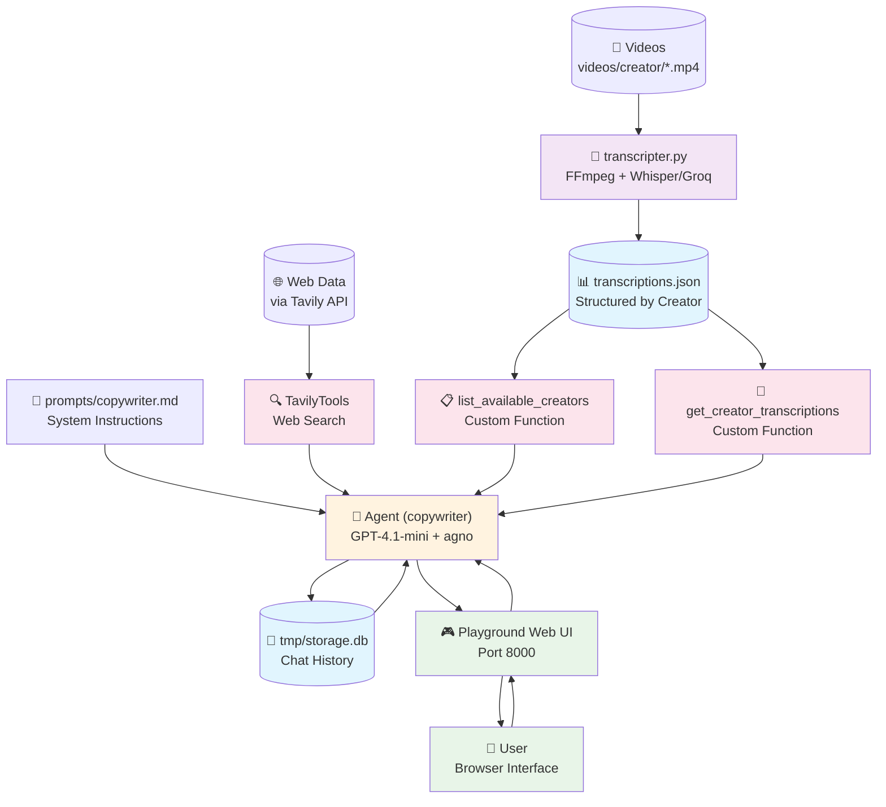

# Arquitetura do Projeto Content Creation Agno Agents

## Diagrama de Arquitetura

## Componentes Principais

### 🎯 Camada de Entrada
- **Videos**: Vídeos MP4 organizados por criador em `videos/creator/*.mp4`
- **Web Data**: Informações externas obtidas via API Tavily

### ⚙️ Camada de Processamento
- **transcripter.py**: Extrai áudio usando FFmpeg e transcreve usando Whisper/Groq

### 💾 Camada de Dados
- **transcriptions.json**: Base estruturada de transcrições organizadas por criador
- **tmp/storage.db**: Histórico de conversas armazenado em SQLite

### 🤖 Camada Central (Agente)
- **Agent (copywriter)**: Agente principal usando GPT-4.1-mini + framework agno
- **3 Ferramentas disponíveis**:
  - TavilyTools: Pesquisa na web
  - list_available_creators: Lista criadores disponíveis
  - get_creator_transcriptions: Obtém transcrições de um criador específico

### 🎮 Camada de Interface
- **Playground Web UI**: Interface web na porta 8000 para interação com o usuário

## Fluxo de Dados

1. **Preparação dos Dados**: 
   - `transcripter.py` processa vídeos da pasta `videos/`
   - Gera arquivo `transcriptions.json` estruturado

2. **Configuração do Agente**: 
   - Agente carrega prompt do arquivo `prompts/copywriter.md`
   - Configura ferramentas e acesso aos dados de transcrição

3. **Interação do Usuário**: 
   - Usuário acessa interface web via navegador
   - Conversa com agente através do Playground

4. **Processamento de Requisições**: 
   - Agente usa ferramentas para pesquisar web e acessar transcrições
   - Gera conteúdo baseado no estilo dos criadores

5. **Persistência**: 
   - Conversas são salvas no SQLite para manter histórico
   - Dados ficam disponíveis entre sessões

## Características da Arquitetura

### ✅ Modular e Desacoplada
- Transcrição independente do agente principal
- Componentes podem ser atualizados separadamente

### ✅ Extensível
- Fácil adição de novos criadores (apenas adicionar vídeos na pasta)
- Novas ferramentas podem ser integradas facilmente

### ✅ Persistente
- Histórico de conversas mantido entre sessões
- Base de transcrições reutilizável

### ✅ Web-based
- Acesso via navegador, sem necessidade de instalação no cliente
- Interface amigável através do Playground do agno

## Tecnologias Utilizadas

- **Framework de Agentes**: agno
- **Modelo de IA**: OpenAI GPT-4.1-mini
- **Transcrição**: Whisper via Groq API
- **Processamento de Áudio**: FFmpeg
- **Pesquisa Web**: Tavily API
- **Banco de Dados**: SQLite
- **Interface Web**: FastAPI + Playground
- **Gerenciamento de Dependências**: uv
